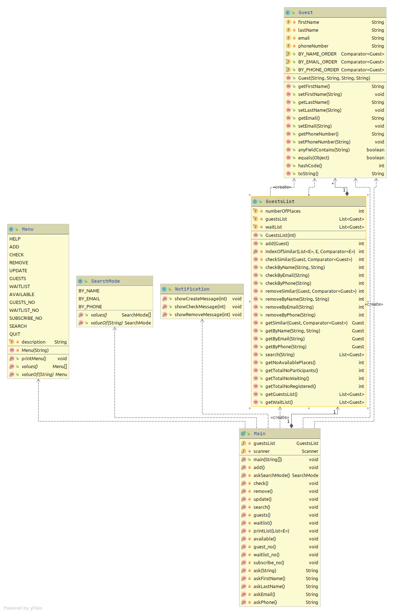

# Sistem de gestiune inscrieri

Proiectul dat reprezinta un sistem de gestiune a inscrierilor dedicat organizatorilor de evenimente pentru a tine 
evidenta persoanelor inregistrate la un eveniment.

Un scenariu de utilizare poate fi vazut in fisierul [TestCase.md](TestCase.md).

In continuare este descris modul de utilizare, dupa care, detaliile de implementare.

## Mod de utilizare
Pentru inceput, organizatorul va specifica numarul de locuri disponibile la evenimentul. Numarul de locuri
este fix si nu poate fi modificat dupa pornirea aplicatiei.

Intern, aplicatia tine evidenta persoanelor inregistrate in doua liste: una cu persoanele care au primit un loc la eveniment,
si o lista de asteptare in caz ca numarul de persoane inregistrate depaseste numarul de locuri disponibile.

Meniul principal al aplicatiei arata in modul urmator:

```
help         - Afiseaza aceasta lista de comenzi
add          - Adauga o noua persoana (inscriere)
check        - Verifica daca o persoana este inscrisa la eveniment
remove       - Sterge o persoana existenta din lista
update       - Actualizeaza detaliile unei persoane
guests       - Lista de persoane care participa la eveniment
waitlist     - Persoanele din lista de asteptare
available    - Numarul de locuri libere
guests_no    - Numarul de persoane care participa la eveniment
waitlist_no  - Numarul de persoane din lista de asteptare
subscribe_no - Numarul total de persoane inscrise
search       - Cauta toti invitatii conform sirului de caractere introdus
quit         - Inchide aplicatia
```

In continuare este detaliata fiecare comanda:
1. **ADD** - adauga o noua inscriere. Este necesara completarea tuturor campurilor, si anume: nume, prenume, email, numar
de telefon. Dupa completare, exista urmatoarele scenarii posibile, fiecare printand un mesaj sugestiv dupa executare:
    1. Exista locuri disponibile la eveniment => persoana este adaugata pe lista de participanti;
    2. Nu exista locuri => persoana este adaugata pe lista de asteptare cu un anumit numar de ordine.
    
    *Nota*: Inainte de adaugare, se verifica ca o persoana cu toate campurile identice sa nu fie pe una din liste. Daca o 
    astfel de persoana exista deja in una din liste, aceasta nu este adaugata din nou.

2. **CHECK** - verifica daca o persoana se afla pe una din liste si printeaza un mesaj. Cautarea persoanelor poate
fi efectuata dupa:
    1. nume si prenume
    2. email
    3. numar de telefon
    
    Organizatorul va introduce mai intai modul de cautare, dupa care campurile necesare cautarii.

3. **REMOVE** - sterge o persoana daca aceasta este gasita in una din liste. Ca si in cazul precedent, cautarea poate
fi efectuata dupa nume si prenume, email sau numar de telefon.

4. **UPDATE** - actualizeaza detaliile unei persoane, indiferent de lista in care se afla. Mai intai are loc cautarea
persoanei dupa nume si prenume, emai, sau numar de telefon. Daca persoana este gasita, utilizatorul va introduce campul
pe care doreste sa-l actualizeze si noua sa valoare.

5. **GUESTS** - printeaza lista de persoane care au un loc rezervat la eveniment. Detaliile includ numele si prenumele
fiecarui participant, emailul si numarul lui de telefon.

6. **WAITLIST** - printeaza lista de asteptare dupa formatul de la punctul precedent.

7. **AVAILABLE** - afiseaza numarul de locuri libere

8. **GUESTS_NO** - afiseaza numarul de persoane care au primit un loc la eveniment

9. **WAITLIST_NO** - afiseaza numarul de persoane aflate pe lista de asteptare

10. **SUBSCRIBE_NO** - afiseaza numarul total de persoane aflate pe ambele liste

11. **SEARCH** - cauta si returneaza o lista cu toate persoanele care contin in campurile lor sirul de caractere introdus
de utilizator.


## Detalii despre implementare

Diagrama UML a acestei aplicatii poate fi vizualizata [aici](uml.png) sau la finalul acestui document. Mai jos este
descrisa structura aplicatiei si modul in care sunt implementate unele functionalitati netriviale.

#### [Main](src/main/java/com/danpopescu/registrationmanagement/Main.java)
Interactiunea cu aplicatia are loc prin intermediul clasei Main care continue o instanta a clasei 
GuestsList si cate o metoda pentru fiecare punct din meniul de mai sus. Fiecare metoda preia input-urile 
de la utilizator si, in functie de acestea, apeleaza metodele specifice din clasa GuestsList.

#### [Guest](src/main/java/com/danpopescu/registrationmanagement/Guest.java) si [GuestTest](src/test/java/com/danpopescu/registrationmanagement/GuestTest.java)
Un obiect de tip Guest reprezinta o persoana care s-a inregistrat pentru eveniment. Acesta va avea campurile nume, prenume,
email si telefon, cat si getteri si setteri pentru aceste campuri. De asemenea, un obiect de acest tip are metoda
`anyFieldContains(String)` care verifica si returneaza `true` daca orice camp al acelui obiect contine sirul de caractere
primit ca parametru.

Clasa Guest contine si trei *inner clase* care implementeaza interfata Comparator si au rolul de a compara obiectele
Guest in functie de nume, email sau numar de telefon.

#### [GuestsList](src/main/java/com/danpopescu/registrationmanagement/GuestsList.java) si [GuestsListTest](src/test/java/com/danpopescu/registrationmanagement/GuestsListTest.java)
Aceasta clasa este inima aplicatiei. Campurile clasei sunt:
1. un numar intreg care reprezinta numarul de locuri totale la eveniment
2. doua liste: lista persoanelor care au confirmat un loc si lista persoanelor aflate in asteptare.

Metodele care consider ca trebuie remarcate sunt:
* `checkByName(String, String)`, `checkByEmail(String)`, `checkByPhone(String)`
* `removeByName(String, String)`, `removeByEmail(String)`, `removeByPhone(String)`
* `getByName(String, String)`, `getByEmail(String)`, `getByPhone(String)`

Toate aceste metode se bazeaza pe acelasi principiu: primesc ca argumente variabilele dupa care se efectueaza operatiunea
(name, email sau phone), creeaza un obiect Guest cu ajutorul acestora (si `""` daca nu avem un camp anume) si apeleaza 
niste metode mai generice folosind obiectul nou creat si un comparator al obiectelor de tip Guest, care depinde de metoda
apelata (`...ByName()`, `...ByEmail()`, `...ByPhone()`). Metodele generice apelate sunt:
* `checkSimilar(Guest, Comparator<Guest>)`
* `removeSimilar(Guest, Comparator<Guest>)`
* `getSimilar(Guest, Comparator<Guest>)`

Acestea, la randul lor, se folosesc de cea mai generica metoda (`indexOfSimilar(List<E>, E, Comparator<E>)`) 
pentru a-si implementa functionalitatea. Metoda `indexOfSimilar()` primeste ca parametri o lista, un obiect de tipul elementelor
din lista si un comparator al acestor elemente, si returneaza indicele primului element din lista similar cu cel primit 
ca parametru, unde similaritatea este determinata de comparatorul primit. Cu ajutorul indicelui returnat, implementarea 
celor trei metode de mai sus este triviala.

#### [Menu](src/main/java/com/danpopescu/registrationmanagement/Menu.java)
Reprezinta un Enum al comenzilor din meniul principal si descrierea fiecareia.

#### [SearchMode](src/main/java/com/danpopescu/registrationmanagement/SearchMode.java)
Reprezinta un Enum al metodelor dupa care pot fi efectuate operatiunile `check`, `remove` si `get`, respectiv:
* `BY_NAME`
* `BY_EMAIL`
* `BY_PHONE`

#### [Notification](src/main/java/com/danpopescu/registrationmanagement/Notification.java)
O clasa auxiliara folosita pentru a afisa mesajele de succes/eroare dupa apelarea metodelor `add`, `check`, si `remove`
din clasa Main.

